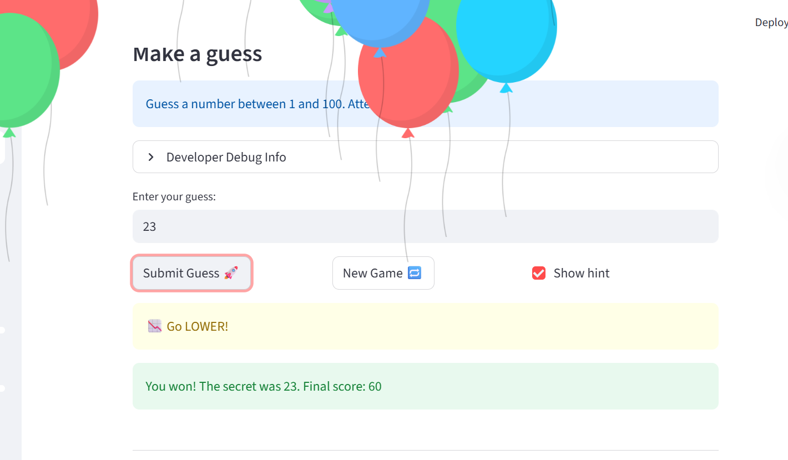
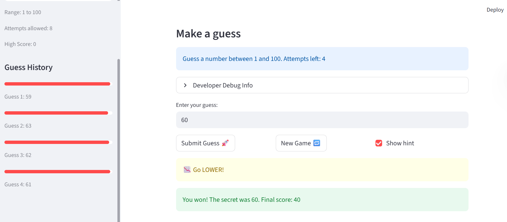

# 🎮 Game Glitch Investigator: The Impossible Guesser

## 🚨 The Situation

You asked an AI to build a simple "Number Guessing Game" using Streamlit.
It wrote the code, ran away, and now the game is unplayable.

- You can't win.
- The hints lie to you.
- The secret number seems to have commitment issues.

## 🛠️ Setup

1. Install dependencies: `pip install -r requirements.txt`
2. Run the broken app: `python -m streamlit run app.py`

## 🕵️‍♂️ Your Mission

1. **Play the game.** Open the "Developer Debug Info" tab in the app to see the secret number. Try to win.
2. **Find the State Bug.** Why does the secret number change every time you click "Submit"? Ask ChatGPT: _"How do I keep a variable from resetting in Streamlit when I click a button?"_
3. **Fix the Logic.** The hints ("Higher/Lower") are wrong. Fix them.
4. **Refactor & Test.** - Move the logic into `logic_utils.py`.
   - Run `pytest` in your terminal.
   - Keep fixing until all tests pass!

## 📝 Document Your Experience

- **Game's purpose:**  
  The game is a number guessing game built with Streamlit where players try to guess a secret number within a range determined by the selected difficulty level (Easy: 1-20, Normal: 1-100, Hard: 1-50). Players have limited attempts based on difficulty, and the game provides hints ("Go HIGHER!" or "Go LOWER!") to guide them. The game tracks score based on attempts used, and includes features like high score persistence and guess history visualization.

- **Bugs I found:**
  - The secret number was resetting on every button click because session state initialization was not properly handled, causing the game to be unplayable.
  - The hints were backwards: "Too High" showed "Go HIGHER!" instead of "Go LOWER!", and vice versa.
  - Session state variables like history, score, and status were not initialized correctly, leading to KeyError exceptions.
  - The attempts counter had an off-by-one error, starting at 1 instead of 0.
  - Invalid guesses were not handled properly, and the game logic was mixed in the main app file instead of being modularized.

- **Fixes I applied:**
  - Moved game logic functions (get_range_for_difficulty, parse_guess, check_guess, update_score) to a separate logic_utils.py file for better organization and testability.
  - Corrected the hint messages in check_guess to display the right directions.
  - Fixed session state initialization by moving it to the appropriate places in the code execution order, ensuring variables persist across reruns.
  - Adjusted the attempts counter initialization to start at 0.
  - Added proper handling for invalid guesses and ensured the game state resets correctly on "New Game".
  - Added two new features: High Score Tracker (saves best score to JSON) and Guess History with Progress Bars (visualizes guess closeness in the sidebar).

## 📸 Demo

## 🚀 Stretch Features

